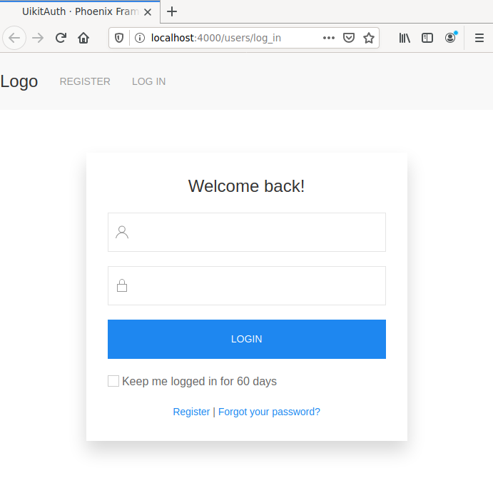
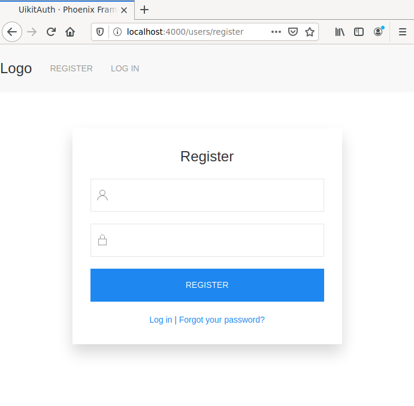
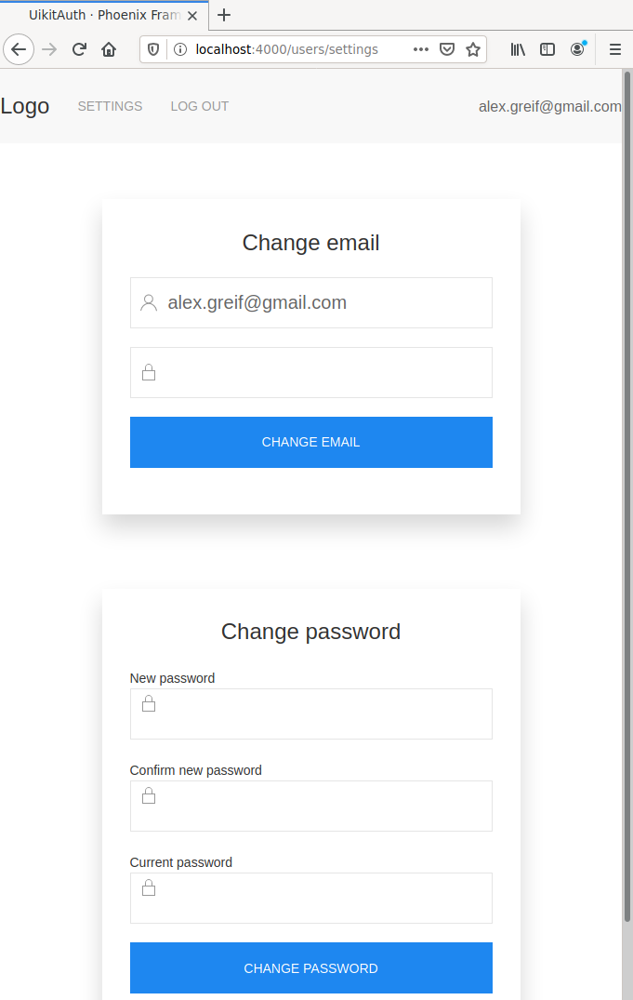

# phx-uikit-auth
Template project with UIKit and phx-auth

This is a small sample with the Phoenix Auth module with adapted Auth forms to UIKit.

# Login screen



# Register screen



# Settings screen



# Code changes

The following files were adjusted:
```
deleted:  lib/uikit_auth_web/templates/layout/_user_menu.html.heex
modified: lib/uikit_auth_web/templates/layout/root.html.heex
modified: lib/uikit_auth_web/templates/user_confirmation/edit.html.heex
modified: lib/uikit_auth_web/templates/user_confirmation/new.html.heex
modified: lib/uikit_auth_web/templates/user_registration/new.html.heex
modified: lib/uikit_auth_web/templates/user_reset_password/edit.html.heex
modified: lib/uikit_auth_web/templates/user_reset_password/new.html.heex
modified: lib/uikit_auth_web/templates/user_session/new.html.heex
modified: lib/uikit_auth_web/templates/user_settings/edit.html.heex
modified: assets/js/app.js
added:    assets/css/uikit.min.css
added:    assets/vendor/uikit-icons.min.js
added:    assets/vendor/uikit.min.js
```
